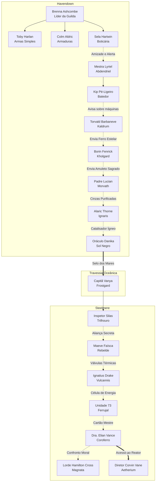

# Bangalore's — Bíblia de Narrativa & Worldbuilding Mestre
## O Épico dos Dois Mundos: Havendown & Steelmere

---

## 1. Visão Geral & Filosofia de Design Narrativo

Este documento estabelece a fundação de narrativa, worldbuilding, conexões sistêmicas e design de experiência para **Bangalore's**. Nosso objetivo é posicionar Bangalore's no mesmo patamar de excelência narrativa que consagrou clássicos como *The Witcher 3*, *Baldur's Gate 3*, *Chrono Trigger* e *Elden Ring*.

### 1.1 O Princípio Central: "O Herói Não é Despejado, Ele é Forjado"
Em RPGs superficiais, o jogador é solto em um mapa genérico, realiza tarefas avulsas sem peso emocional ("mate 5 lobos") e de repente é chamado de salvador. 
Em **Bangalore's**, cada passo do herói é contextualizado por uma crise ecológica, tecnológica e espiritual urgente:
- As águas de Havendown estão secando e cristalizando com febre ciana não por acaso, mas porque **bombas de sucção subaquáticas do império industrial de Steelmere** estão drenando os veios vitais de Éter primário do continente rúnico.
- O jogador começa como um forasteiro local nas Planícies de Alvora cuja sobrevivência imediata depende de entender as tensões locais (batedores doentes, bandoleiros desesperados, forjas com falta de minério puro).
- Conforme avança, descobre que cada problema regional é um tentáculo do mesmo cataclismo global: a ambição cega da elite do latão de Steelmere e o rasgo cósmico do Sol Negro em Havendown.

### 1.2 Os Quatro Pilares Ludonarrativos

```
                     ╔═════════════════════════════════╗
                     ║    O SALVADOR DE DOIS MUNDOS    ║
                     ╚═════════════════════════════════╝
                                      ▲
                                      │
         ┌────────────────────────────┼────────────────────────────┐
         │                            │                            │
┌──────────────────┐        ┌──────────────────┐        ┌──────────────────┐
│  A TEIA SOCIAL   │        │ O ITEM EM 3 NÍVEIS│        │ CONSEQUÊNCIA REAL│
│  Cada NPC tem um │        │ Mecânica + Lore  │        │ Escolhas afetam  │
│  rosto, agenda e │        │ + Reação viva do │        │ rotas, diálogos  │
│  laço com outro  │        │ mundo e dos NPCs │        │ e alianças       │
└──────────────────┘        └──────────────────┘        └──────────────────┘
```

1. **A Teia Social Interconectada**: Nenhum NPC existe no vácuo. Quando o jogador fala com Sela Hartwin em Alvora, ela menciona Lyriel em Abdendriel; Lyriel se preocupa com Kip; Kip monitora os comboios para as minas de Torvald em Kaldrum; Torvald envia ligas sagradas para Borin Fenrick em Kholgard; e Borin conhece o horror das catacumbas guardadas pelo Padre Lucian em Morvath.
2. **O Item em Três Camadas (Mnemonic Artifacts)**:
   - *Camada 1 (Mecânica)*: Atributos, bônus elementais e habilidades ativas únicas.
   - *Camada 2 (Proveniência & Memória)*: Quem o forjou, qual tragédia testemunhou e qual segredo do mundo ele sussurra.
   - *Camada 3 (Eco no Mundo)*: NPCs reconhecem o item equipado, comentam sobre seu legado ou desbloqueiam opções exclusivas de diálogo.
3. **Escalada Orgânica de Escopo (Local -> Continental -> Intercontinental -> Cósmico)**:
   - *Ato I & II (Níveis 1-20)*: Salvando as fronteiras de Havendown e restaurando o equilíbrio elemental dos bosques e cavernas.
   - *Ato III & IV (Níveis 20-40)*: Cruzando as terras amaldiçoadas e desvendando a grande fratura do Sol Negro.
   - *Ato V & VI (Níveis 40-70)*: A Grande Travessia de Éter rumo a Steelmere; infiltrando o sindicato industrial, aliando-se aos rebeldes e aos autômatos conscientes.
   - *Ato VII (Níveis 70-100)*: O Núcleo de Aetherium e a convergência dos dois mundos.

---

## 2. A Cosmologia e o Grande Conflito

```
      HAVENDOWN (O Continente Rúnico)               STEELMERE (O Império a Vapor)
  [Magia Ancestral, Runas e Elementos]         [Vapor, Tubulações, Engrenagens e Latão]
                  │                                              │
                  ▼                                              ▼
           Veios de Éter Puro                            Dreno Megalopolitano
                  │                                              │
                  └────────► [ CABOS SUBMARINOS ] ◄──────────────┘
                                      │
                                      ▼
                         A RUPTURA DO SOL NEGRO
                      (A Ameaça Cósmica Comum)
```

### 2.1 Havendown: O Berço Rúnico
Havendown é uma terra ancestral forjada ao redor de sete grandes monolitos elementais. A vida, o clima e a fertilidade dependem do fluxo harmonioso do Éter Primordial:
- **Planícies de Alvora**: Celeiro fértil, portal de entrada do continente e sede da Guilda dos Mercenários liderada por Brenna Ashcombe.
- **Floresta de Abdendriel**: Santuário dos druidas e espíritos arbóreos, guardado por Mestra Lyriel. Onde o Éter assume a forma de seiva luminosa.
- **Kholgard & Khar-Dur**: Cidades subterrâneas de granito e bronze rúnico esculpidas pelos grandes artesãos da antiguidade. Lar do Ferreiro Borin Fenrick.
- **Serra de Kaldrum**: Picos congelados e minas abissais ricas em Ferro Estelar puro, supervisionadas pelo carismático Torvald Barbaneve.
- **Pico de Ignaris**: Vulcão sagrado com caldeiras magmáticas naturais onde a Ordem dos Legionários e Monges do Fogo temperam armaduras e armas divinas.
- **Terras de Morvath**: Planícies cinzentas e catacumbas ancestrais onde as almas dos primeiros reis repousam, vigiadas pelo soturno Padre Lucian.
- **Reino do Sol Negro**: O extremo oriental onde o tecido da realidade começou a se rasgar em decorrência da drenagem incessante, liberando horrores do vazio sob a liderança do usurpador Malgor.

### 2.2 Steelmere: O Colosso Mecânico
Do outro lado do Mar das Tormentas ergue-se Steelmere, um império movido a vapor, engrenagens monumentais e Aetherium industrial:
- **Cumes de Frostgard**: Geleiras perfuradas por brocas mecânicas titânicas e protegidas pela Capitã Vanya.
- **Bosque de Engrenverde**: Floresta tropical onde árvores centenárias foram engaioladas em tubos de cobre sob o olhar do excêntrico Garrick Engrenafolha.
- **Campos de Trilhouro**: Fazendas industriais e entroncamentos ferroviários onde comboios blindados transportam minério sob a vigília estressada do Inspetor Silas Sterling.
- **Caldeira de Vulcannis**: Fornalha vulcânica canalizada em condutos de titânio sob a supervisão ruidosa do Mestre-Fogueiro Ignatius Drake.
- **Charco de Ferrujal**: Pântano tóxico formado pelos rejeitos das fundições, onde autômatos descartados despertaram livre-arbítrio sob a liderança da Unidade 73 (Rust).
- **Cidade de Coroferro**: A metrópole vitoriana de latão polido, arranha-céus enfumaçados e torres de relógio, governada pela ganância de Lorde Hamilton Cross e pela culpa da Dra. Elian Vance.
- **Núcleo de Aetherium**: O reator colossal que centraliza o dreno planetário, guardado pelo impassível Diretor Corvin Vane.

---

## 3. Matriz de Personagens & Teia de Relacionamentos (NPC Social Graph)

Os 24 NPCs de Bangalore's não são meros lojistas estáticos. Eles possuem passados compartilhados, ressentimentos, lealdades e interdependências.



### Tabela de Relações e Dinâmica dos Personagens

| NPC | Localização | Personalidade | Motivação Oculta | Interlocutor Direto |
|---|---|---|---|---|
| **Brenna Ashcombe** | Alvora | Sarcástica | Proteger os mercenários órfãos da guerra das sombras. | Toby, Colm, Sela |
| **Sela Hartwin** | Alvora | Hilária | Descobrir a cura da febre ciana antes que alcance sua vila natal. | Lyriel (Abdendriel) |
| **Mestra Lyriel** | Abdendriel | Sonhadora | Impedir que a drenagem de seiva desperte a Matriarca Corrompida. | Sela, Kip |
| **Kip Pé-Ligeiro** | Abdendriel | Medroso | Sobreviver tempo suficiente para reencontrar seu irmão em Kaldrum. | Lyriel, Torvald |
| **Torvald Barbaneve** | Kaldrum | Hilário / Enérgico | Fornecer metal rúnico aos que defendem a superfície. | Kip, Borin |
| **Borin Fenrick** | Kholgard | Rabugento | Honrar o pacto com os reis antigos e forjar a arma do Escolhido. | Torvald, Lucian |
| **Padre Lucian** | Morvath | Sombrio | Salvar as almas dos batedores caídos e lacrar as catacumbas. | Borin, Alaric |
| **Alaric Thorne** | Ignaris | Dramático | Forjar ligas à prova do fogo vil cósmico do eclipse. | Lucian, Danika |
| **Oráculo Danika** | Sol Negro | Seca / Solene | Revelar que a ameaça a Havendown se origina em Steelmere. | Alaric, Vanya |
| **Capitã Vanya** | Frostgard | Firme / Pragmática | Fazer a ponte secreta entre dissidentes dos dois continentes. | Danika, Silas |
| **Inspetor Silas** | Trilhouro | Nervoso / Metódico | Sabotar os comboios do Sindicato sem perder o emprego ou a cabeça. | Vanya, Maeve |
| **Maeve Faísca** | Trilhouro | Apaixonada / Rebelde | Libertar a classe operária e destruir a tirania do latão. | Silas, Drake |
| **Ignatius Drake** | Vulcannis | Ruidoso / Afetuoso | Impedir a explosão térmica das fornalhas de Vulcannis. | Maeve, Unidade 73 |
| **Unidade 73 (Rust)** | Ferrujal | Literal / Curioso | Provar que seres de silício e cobre têm dignidade e alma. | Drake, Vance |
| **Dra. Elian Vance** | Coroferro | Arrependida / Brilhante | Reverter o dano do reator que ela mesma projetou. | Rust, Vane |
| **Lorde Hamilton Cross**| Coroferro | Pomposo / Ganancioso | Lucrar com ambos os lados até perceber que ouro não detém o fim do mundo. | Silas, Vance |
| **Diretor Corvin Vane** | Aetherium | Grave / Inabalável | Manter o reator estabilizado custe o que custar — até ser confrontado pela verdade. | Vance, Jogador |

---

## 4. O Sistema de Itens Mnemônicos (Três Camadas)

Cada equipamento relevante no jogo agora carrega a estrutura:
1. **Atributos de Combate**: Ataque, Vida, Defesa, Elemento, Habilidade Ativa/Passiva.
2. **História / Proveniência**: Contexto histórico e artesanal.
3. **Reatividade & Eco no Mundo**: Reação de personagens ao verem ou receberem o item.

### Exemplos de Itens Mnemônicos Integrados

#### 1. Lâmina do Último Sentinela (`lamina_sentinela`)
- **Tipo**: Espada Épica (Mão Direita) | Elemento: Arcano
- **Mecânica**: +4 Ataque, Ativo de Impacto Arcano (+2 dano imediato).
- **Proveniência**: Empunhada pelo Capitão Valerius durante o Cerco de Kholgard contra os primeiros golens infiltradores. O metal absorveu a luz do monólito de pedra.
- **Eco no Mundo**: Quando equipada em Kholgard, o ferreiro Borin Fenrick interrompe sua rabugice habitual e murmura: *"Essa bainha... você carrega a lâmina de Valerius. Ele morreu de pé nos portões. Não o envergonhe."*

#### 2. Manto de Cinzas do Dragão (`manto_cinzas`)
- **Tipo**: Peitoral Épico | Elemento: Fogo
- **Mecânica**: +2 Vida, +2 Defesa, Ativo de Proteção de Brasa.
- **Proveniência**: Tecido com cinzas recolhidas da cratera de Ignaroth nas alturas do Pico de Ignaris, reforçado com fios de ouro rúnico.
- **Eco no Mundo**: No Pico de Ignaris, Alaric Thorne exalta: *"O calor desse manto rivaliza com a minha própria fornalha! Um guerreiro digno de vestir as cinzas do dragão finalmente surgiu!"*

#### 3. Célula de Aetherium Estável (`celula_aetherium_pura`)
- **Tipo**: Item de Missão Mítica & Componente Rúnico
- **Mecânica**: Concede imunidade a sobrecarga e purifica veneno/ácido.
- **Proveniência**: O único cilindro de Aetherium extraído das profundezas sem traços de contaminação por óleo sulfúrico, calibrado à mão pela Dra. Vance.
- **Eco no Mundo**: Ao ser apresentado à Unidade 73 em Ferrujal, o autômato pausa suas rotinas de combate, ajoelha-se no lodo de ferrugem e diz: *"Carga pura detectada. Meus sensores identificam isso como esperança."*

---

## 5. Roteiro da Campanha: Os 7 Atos da Salvação Global

```
  ATO 1: A Febre das Planícies       (Alvora -> Abdendriel)       [Níveis 1-12]
  ATO 2: As Vozes de Ferro          (Kaldrum -> Kholgard)        [Níveis 12-22]
  ATO 3: A Cinza e a Capela         (Morvath -> Ignaris)         [Níveis 20-36]
  ATO 4: O Rasgo do Sol Negro       (Coracao do Eclipse)         [Níveis 32-52]
  ATO 5: A Grande Travessia         (Frostgard -> Trilhouro)     [Níveis 40-60]
  ATO 6: A Fornalha dos Esquecidos  (Vulcannis -> Ferrujal)      [Níveis 56-72]
  ATO 7: O Pulso de Dois Mundos     (Coroferro -> Aetherium)     [Níveis 66-100]
```

### Arco Detalhado por Ato

#### Ato 1: A Febre das Planícies (Níveis 1-12)
- **Localização**: Planícies de Alvora e Floresta de Abdendriel.
- **O Incidente**: Fontes de água adoecem aldeões com uma estranha névoa ciana metálica; bandoleiros estão atacando comboios em busca de remédios.
- **O Despertar do Herói**: O jogador ajuda Sela Hartwin a sintetizar o antídoto e viaja a pé até Abdendriel, cruzando trilhas infestadas de goblins corrompidos.
- **Clímax do Ato**: Confronto com o Chefe Bandoleiro e descoberta de que as ferramentas dos bandidos continham selos de latão desconhecidos.

#### Ato 2: As Vozes de Ferro (Níveis 12-22)
- **Localização**: Floresta de Abdendriel, Serra de Kaldrum e Kholgard.
- **O Incidente**: Tremores violentos abalam as montanhas. O batedor Kip relata perfurações subterrâneas que não são de origem anã.
- **A Revelação**: Torvald descobre que máquinas mecânicas clandestinas estão minerando Ferro Estelar no fundo das minas.
- **Clímax do Ato**: Descoberta das ruínas do Labirinto de Kholgard e forja da primeira arma de liga rúnica pura com Borin Fenrick.

#### Ato 3: A Cinza e a Capela (Níveis 20-36)
- **Localização**: Kholgard, Terras de Morvath e Pico de Ignaris.
- **O Incidente**: As perfurações profundas romperam os selos das catacumbas antigas em Morvath, despertando espectros e necromantes.
- **A Peregrinação**: O herói leva amuletos consagrados ao solitário Padre Lucian, recolhe as Cinzas Purificadas das almas salvas e as transporta até o fogo sagrado de Alaric Thorne em Ignaris.
- **Clímax do Ato**: O dragão Ignaroth desperta diante do desequilíbrio e exige um duelo ritual antes de permitir que o herói alcance o leste.

#### Ato 4: O Rasgo do Sol Negro & A Descoberta (Níveis 32-52)
- **Localização**: Reino do Sol Negro e Cumes de Frostgard.
- **O Incidente**: O Reino do Sol Negro atinge o ápice de sua instabilidade. O vilão Malgor tenta canalizar o vácuo gerado pela drenagem para usurpar a coroa eterna.
- **A Revelação Magna**: A Oráculo Danika revela ao herói que Malgor não é a causa raiz, mas um abutre se alimentando da ferida aberta por cabos submarinos vindos de **Steelmere**!
- **Clímax do Ato**: Derrota das sombras de Malgor, recebimento do Selo do Navegador do Éter e embarque no quebra-gelos através da tempestade oceânica.

#### Ato 5: A Grande Travessia & As Ferrovias de Latão (Níveis 40-60)
- **Localização**: Cumes de Frostgard e Campos de Trilhouro.
- **O Choque Cultural**: O herói desembarca em um mundo coberto de gelo, vapor, sirenes industriais e guardas armados do Sindicato do Latão.
- **A Aliança Subterrânea**: A Capitã Vanya apresenta o herói ao Inspetor Silas, um funcionário arrependido que fornece as rotas dos trens de carga para a rebelde Maeve Faísca.
- **Clímax do Ato**: Emboscada a um comboio de Aetherium militarizado em Trilhouro e resgate de suprimentos vitais para os operários.

#### Ato 6: A Fornalha dos Esquecidos (Níveis 56-72)
- **Localização**: Caldeira de Vulcannis e Charco de Ferrujal.
- **O Incidente**: O Sindicato aumenta a pressão das caldeiras a níveis catastróficos para acelerar a drenagem de Havendown.
- **A Solidariedade dos Descartados**: O herói impede a explosão de Vulcannis com Ignatius Drake e desce ao lixão de Ferrujal, onde descobre a colônia pacífica de autômatos conscientes da Unidade 73.
- **Clímax do Ato**: Resgate da memória autonômica que prova que o Reator de Aetherium não é apenas uma máquina, mas uma consciência cósmica aprisionada que está sofrendo.

#### Ato 7: O Pulso de Dois Mundos (Níveis 66-100)
- **Localização**: Cidade de Coroferro e Núcleo de Aetherium.
- **A Infiltração**: O herói entra em Coroferro através dos esgotos industriais com o cartão mestre da Unidade 73 e encontra a Dra. Elian Vance em seu refúgio secreto.
- **O Confronto de Ideais**: Confronto com Lorde Hamilton Cross e o Diretor Corvin Vane no coração do reator.
- **A Escolha Final da Campanha**:
  - *Caminho da Harmonia Rúnico-Mecânica*: Sintonizar os monolitos de Havendown com a tecnologia de vapor de Steelmere, cessando o dreno destrutivo e iniciando uma era de cooperação simbiótica entre magia e ciência.
  - *Caminho da Soberania Primordial*: Desconectar permanentemente os cabos submarinos, forçando Steelmere a viver dentro dos limites de seus recursos e devolvendo a Havendown sua plenitude ancestral.
  - *Caminho do Trono do Vazio*: Reivindicar para si a energia de ambos os mundos, tornando-se o Soberano Eterno além da carne e da engrenagem.

---

## 6. Diretrizes de Implementação Técnica

Para que todo esse mundo ganhe vida sem gargalos de performance ou complexidade desnecessária para o usuário:
1. **Zero Sobrecarga de Interface**:
   - Missões de campanha são integradas às conversas naturais com os NPCs que o jogador já visita para comprar, forjar ou consultar crônicas.
   - Itens de missão possuem ícones claros e são rastreados automaticamente na mochila sem ocupar os preciosos 8 slots de combate.
2. **Reatividade Dinâmica na UI**:
   - Falas dos NPCs se ajustam ao status da missão (Oferta -> Em Progresso -> Boas-vindas -> Conclusão).
   - Títulos de lore (`loreTitle`) obtidos em missões enriquecem a Ficha do Herói e as Crônicas.
3. **Compatibilidade e Testes Automatizados**:
   - Manter 100% de conformidade com os testes existentes (`npm test`).
   - Todos os IDs de NPCs, territórios e itens referenciados devem ser estritamente válidos em tempo de compilação.

---

## 7. Status de Implementação (v0.9.11 • 28/09/2026)

| Pilar / seção | Onde vive no código | Como aparece no jogo |
|---|---|---|
| Teia social (§3) | `NPC_LORE` em `src/data/worldLore.ts` (laços + motivação oculta dos 24 NPCs) | Diálogo do NPC → "Laços e segredos". A motivação só é revelada depois de uma missão de história que passe pelo NPC (`npcTrustEarned`). |
| Item em 3 camadas (§4) | Camada 2: campo `historia` em `src/data/equipamentos.json`. Camada 3: `ITEM_ECHOES` em `worldLore.ts` | Detalhe do item mostra "História" e "Reconhecida por". O NPC comenta a peça quando o herói a usa equipada. |
| Célula de Aetherium Estável (§4) | Missão `q_vance_aetherium_cell` (Vance → Unidade 73) em `src/data/storyQuests.ts` | Item de missão; a fala da Unidade 73 é a conclusão. Recompensa: Elixir da Fênix (`reward.itemReward`). A imunidade a sobrecarga não tem efeito de combate. |
| 7 atos (§5) | `STORY_ACTS` em `worldLore.ts`; `requires` em `storyQuests.ts` segura as missões paralelas no ato certo | Diário de Missões → "Arco da campanha"; rótulo do ato em cada missão e no rastreador do mapa. |
| Escolha final (§5, Ato 7) | `CAMPAIGN_ENDINGS` + `ENDING_REACTIONS` em `worldLore.ts`; `decidesEnding` em `q_steelmere_final_resonance`; `turnInStoryQuest(id, endingId)` | Entrega a Corvin Vane com os 3 caminhos. O desfecho vira flag `final:<id>`, título, epílogo no Diário e fala nova de 11 NPCs. Exige `q_rust_to_vance` + `q_cross_secret_ledger` + a memória do Núcleo. |
| Falas por status (§6.2) | `QuestCompletionCard` em `src/ui/StoryLore.tsx` | A fala de conclusão (`dialogue.completion`) aparece depois da entrega e pode ser relida no Diário. |
| Títulos de lore (§6.2) | `storyLoreTitles` / `setSelectedTitle` em `src/store/game.ts` | Diário → "Títulos da Jornada"; o título escolhido aparece na Ficha. |
| IDs válidos (§6.3) | `QA Suite: World Lore Integrity` em `src/qa-verification.test.ts` | — |

Os capítulos de `STORY_CHAPTERS` (`src/data/expansion.ts`) passaram a ser narrados pelo elenco deste documento (Brenna, Lyriel, Kip, Gideon, Borin, Padre Lucian) em vez de Ilyra/Seris/Varyn/Brokk. O clímax do Ato 1 menciona os selos de latão.
